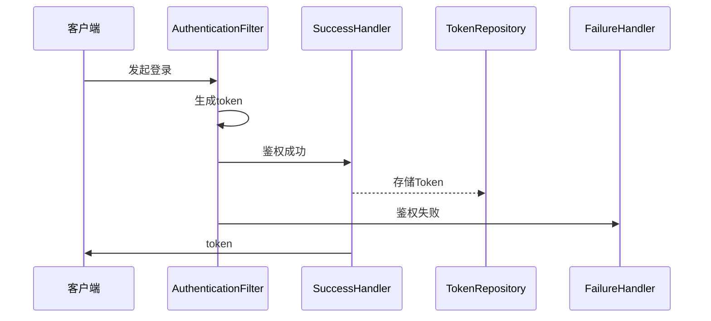
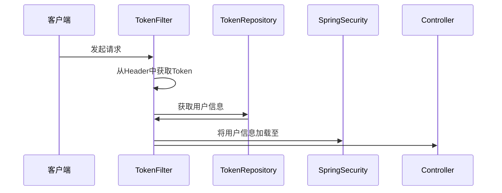

二十七、整合SpringSecurity之前后端分离Token鉴权
---

### 相关知识
目前大部分项目都使用了前后端分离的架构模式，
因为客户端不再是单纯的网页，还可以是手机，平板，公众号，小程序等等，
很重要的是，不是每一个客户端都能够支持 session+cookie 的模式，于是，token 模式开始大行其道，
其实 token 跟 session+cookie 模式本质上是一样的，只是 cookie 由浏览器定义了客户端存储模式，这对于不是浏览器的客户端则行不通，而 token 则需要客户端自行存储，客户端可以根据自已的特性进行差别化存储。

使用 Token 进行前后端交互鉴权的流程
登录流程


鉴权流程


### 目标
整合 SpringSecurity 实现使用 token 进行鉴权。

### 准备工作
创建用户表 `user`、角色表 `role`、用户角色关系表 `user_role` 及 `token` 表

```mysql
CREATE TABLE `role` (
  `id` bigint(20) NOT NULL AUTO_INCREMENT,
  `rolename` varchar(32) NOT NULL COMMENT '角色名',
  PRIMARY KEY (`id`)
) ENGINE=InnoDB AUTO_INCREMENT=15 DEFAULT CHARSET=utf8mb4 COMMENT='角色';

CREATE TABLE `user` (
  `id` bigint(20) NOT NULL AUTO_INCREMENT,
  `username` varchar(32) NOT NULL COMMENT '用户名',
  `password` varchar(128) NOT NULL COMMENT '密码',
  PRIMARY KEY (`id`)
) ENGINE=InnoDB AUTO_INCREMENT=15 DEFAULT CHARSET=utf8mb4 COMMENT='用户';

CREATE TABLE `user_role` (
  `id` bigint(20) NOT NULL AUTO_INCREMENT,
  `user_id` bigint(20) NOT NULL,
  `role_id` bigint(20) NOT NULL,
  PRIMARY KEY (`id`),
  KEY `user_id` (`user_id`,`role_id`)
) ENGINE=InnoDB AUTO_INCREMENT=4 DEFAULT CHARSET=utf8mb4 COMMENT='用户角色关系表';

CREATE TABLE `token` (
  `id` bigint(20) NOT NULL AUTO_INCREMENT,
  `token` varchar(128) NOT NULL COMMENT 'token',
  `user_id` bigint(20) NOT NULL COMMENT '用户ID',
  PRIMARY KEY (`id`)
) ENGINE=InnoDB AUTO_INCREMENT=4 DEFAULT CHARSET=utf8mb4 COMMENT='token';
```

### 操作步骤
#### 添加依赖
引入 Spring Boot Starter 父工程
```xml
<parent>
    <groupId>org.springframework.boot</groupId>
    <artifactId>spring-boot-starter-parent</artifactId>
    <version>2.0.5.RELEASE</version>
</parent>
```

添加 `springSecurity` 及 `mybatisPlus` 的依赖，添加后的整体依赖如下
```xml
<dependencies>
    <dependency>
        <groupId>org.springframework.boot</groupId>
        <artifactId>spring-boot-starter-web</artifactId>
    </dependency>

    <dependency>
        <groupId>org.springframework.boot</groupId>
        <artifactId>spring-boot-starter-test</artifactId>
        <scope>test</scope>
    </dependency>

    <dependency>
        <groupId>org.projectlombok</groupId>
        <artifactId>lombok</artifactId>
        <scope>provided</scope>
    </dependency>

    <dependency>
        <groupId>org.springframework.boot</groupId>
        <artifactId>spring-boot-starter-security</artifactId>
    </dependency>

    <dependency>
        <groupId>com.baomidou</groupId>
        <artifactId>mybatis-plus-boot-starter</artifactId>
        <version>3.2.0</version>
    </dependency>

    <dependency>
        <groupId>mysql</groupId>
        <artifactId>mysql-connector-java</artifactId>
    </dependency>
</dependencies>
```
#### 配置
配置一下数据源
```yaml
spring:
  datasource:
    url: jdbc:mysql://127.0.0.1:3306/test?characterEncoding=utf8&useSSL=false
    username: app
    password: 123456
```
#### 编码
##### 实体类
角色实体类 Role，实现权限接口 GrantedAuthority
```java
@Data
@NoArgsConstructor
@AllArgsConstructor
@TableName("role")
public class Role implements GrantedAuthority {

    @TableId(type = IdType.AUTO)
    private Long id;
    private String rolename;

    @Override
    public String getAuthority() {
        return this.rolename;
    }
}
```
用户实体类 user，实现权限接口 UserDetails，主要方法是 getAuthorities，用于获取用户的角色列表
```java
@Data
@NoArgsConstructor
@AllArgsConstructor
@TableName("user")
public class User implements UserDetails {

    @TableId(type = IdType.AUTO)
    private Long id;
    private String username;
    private String password;
    @TableField(exist = false)
    private List<Role> roleList;
    @TableField(exist = false)
    private String token;

    @Override
    public Collection<? extends GrantedAuthority> getAuthorities() {
        return roleList;
    }

    @Override
    public boolean isAccountNonExpired() {
        return true;
    }

    @Override
    public boolean isAccountNonLocked() {
        return true;
    }

    @Override
    public boolean isCredentialsNonExpired() {
        return true;
    }

    @Override
    public boolean isEnabled() {
        return true;
    }

}
```
用户角色关系实体
```java
@Data
@NoArgsConstructor
@AllArgsConstructor
@TableName("user_role")
public class UserRole {
    @TableId(type = IdType.AUTO)
    private Long id;
    private Long userId;
    private Long roleId;
}
```
Token实体
```java
@Data
@TableName("token")
public class Token {
    @TableId(type = IdType.AUTO)
    private Long id;
    private String token;
    private Long userId;
}
```
##### Repository 层
分别为四个实体类添加 Mapper
```java
@Mapper
public interface RoleRepository extends BaseMapper<Role> {
}
@Mapper
public interface UserRepository extends BaseMapper<User> {
}
@Mapper
public interface UserRoleRepository extends BaseMapper<UserRole> {
}
@Mapper
public interface TokenRepository extends BaseMapper<Token> {
}
```
#### 权限配置
##### 实现 UserDetailsService 接口
UserDetailsService 是 SpringSecurity 提供的登陆时用于根据用户名获取用户信息的接口
```java
@AllArgsConstructor
@Service
public class UserService implements UserDetailsService {

    private UserRepository userRepository;
    private RoleRepository roleRepository;
    private UserRoleRepository userRoleRepository;

    @Override
    public UserDetails loadUserByUsername(String username) throws UsernameNotFoundException {
        if (username == null || username.isEmpty()) {
            throw new UsernameNotFoundException("用户名不能为空");
        }
        User user = userRepository.selectOne(new QueryWrapper<User>().lambda().eq(User::getUsername, username));
        if (user == null) {
            throw new UsernameNotFoundException("用户不存在");
        }
        List<UserRole> userRoles = userRoleRepository.selectList(new QueryWrapper<UserRole>().lambda().eq(UserRole::getUserId, user.getId()));
        if (userRoles != null && !userRoles.isEmpty()) {
            List<Long> roleIds = userRoles.stream().map(UserRole::getRoleId).collect(Collectors.toList());
            List<Role> roles = roleRepository.selectList(new QueryWrapper<Role>().lambda().in(Role::getId, roleIds));
            user.setRoleList(roles);
        }
        return user;
    }

}
```

##### 自定义登录参数格式
```java
@Data
public class LoginDto {

    private String mobile;
    private String password;
    private String dycode;

}
```

##### 自定义登录鉴权过滤器
继承 SpringSecurity 提供的 AbstractAuthenticationProcessingFilter 类，实现 attemptAuthentication 方法，用于登录校验。
本例中，模拟前端使用 json 格式传递参数，所以通过 objectMapper.readValue 的方式从流中获取入参，之后借用了用户名密码登录的校验，
如果鉴权成功，则生成 token 存库并将 token 返回给前端。
```java
@Data
public class JsonAuthenticationFilter extends AbstractAuthenticationProcessingFilter {

    @Autowired
    private ObjectMapper objectMapper;

    @Autowired
    private TokenRepository tokenRepository;

    public JsonAuthenticationFilter() {
        super(new AntPathRequestMatcher("/login", "POST"));
    }

    @Override
    public Authentication attemptAuthentication(HttpServletRequest request, HttpServletResponse response)
            throws AuthenticationException, IOException, ServletException {
        // 从输入流中获取到登录的信息
        try {
            LoginDto loginUser = new ObjectMapper().readValue(request.getInputStream(), LoginDto.class);
            Authentication authenticate = getAuthenticationManager().authenticate(
                    new UsernamePasswordAuthenticationToken(loginUser.getMobile(), loginUser.getPassword())
            );
            if (authenticate.isAuthenticated()) {
                User user = (User) authenticate.getPrincipal();
                Token token = new Token();
                token.setToken(UUID.randomUUID().toString());
                token.setUserId(user.getId());
                tokenRepository.insert(token);
                user.setToken(token.getToken());
            }
            return authenticate;
        } catch (IOException e) {
            e.printStackTrace();
            return null;
        }
    }

}
```

##### 自定义登陆成功后处理
实现 SpringSecurity 提供的 AuthenticationSuccessHandler 接口，使用 JSON 格式返回
```java
@AllArgsConstructor
public class JsonLoginSuccessHandler implements AuthenticationSuccessHandler {

    private ObjectMapper objectMapper;

    @Override
    public void onAuthenticationSuccess(HttpServletRequest request, HttpServletResponse response,
                                        Authentication authentication) throws IOException, ServletException {
        response.setStatus(HttpServletResponse.SC_OK);
        response.setContentType(MediaType.APPLICATION_JSON_UTF8_VALUE);
        response.getWriter().write(objectMapper.writeValueAsString(authentication));
    }

}
```

##### 自定义登陆失败后处理
实现 SpringSecurity 提供的 AuthenticationFailureHandler 接口，使用 JSON 格式返回
```java
public class JsonLoginFailureHandler implements AuthenticationFailureHandler {

    @Override
    public void onAuthenticationFailure(HttpServletRequest request, HttpServletResponse response, 
                                        AuthenticationException exception) throws IOException, ServletException {
        response.setStatus(HttpServletResponse.SC_UNAUTHORIZED);
        response.setContentType(MediaType.APPLICATION_JSON_UTF8_VALUE);
        response.getWriter().write("{\"message\":\"" + exception.getMessage() + "\"}");
    }

}
```

##### 自定义权限校验失败后处理
登陆成功之后，访问接口之前 SpringSecurity 会进行鉴权，如果没有访问权限，需要对返回进行处理。
实现 SpringSecurity 提供的 AccessDeniedHandler 接口，使用 JSON 格式返回
```java
public class JsonAccessDeniedHandler implements AccessDeniedHandler {

    @Override
    public void handle(HttpServletRequest request, HttpServletResponse response,
                       AccessDeniedException exception) throws IOException, ServletException {
        response.setStatus(HttpServletResponse.SC_FORBIDDEN);
        response.setContentType(MediaType.APPLICATION_JSON_UTF8_VALUE);
        response.getWriter().write("{\"message\":\"" + exception.getMessage() + "\"}");
    }

}
```

##### 自定义未登录后处理
实现 SpringSecurity 提供的 AuthenticationEntryPoint 接口，使用 JSON 格式返回
```java
public class JsonAuthenticationEntryPoint implements AuthenticationEntryPoint {

    @Override
    public void commence(HttpServletRequest request, HttpServletResponse response,
                         AuthenticationException exception) throws IOException, ServletException {
        response.setStatus(HttpServletResponse.SC_FORBIDDEN);
        response.setContentType(MediaType.APPLICATION_JSON_UTF8_VALUE);
        response.getWriter().write("{\"message\":\"" + exception.getMessage() + "\"}");
    }

}
```

##### 自定义 Token 验证过滤器
客户端登录成功时，后台会把生成的 token 返回给前端，之后客户端每次请求后台接口将会把这个 token 附在 header 头中传递给后台，
后台会验证这个 token 是否有效，如果有效就把用户信息加载至 SpringSecurity 中，如果无效则会跳转至上一步提供 AuthenticationEntryPoint 进行处理。
```java
public class TokenAuthenticationFilter extends OncePerRequestFilter {

    @Autowired
    private TokenRepository tokenRepository;
    @Autowired
    private UserRepository userRepository;
    @Autowired
    private RoleRepository roleRepository;
    @Autowired
    private UserRoleRepository userRoleRepository;

    @Override
    protected void doFilterInternal(HttpServletRequest request, HttpServletResponse response,
                                    FilterChain filterChain) throws ServletException, IOException {
        String tokenStr = request.getHeader("token");
        if (tokenStr != null && !tokenStr.isEmpty()) {
            Token tokenDb = tokenRepository.selectOne(new QueryWrapper<Token>().lambda().eq(Token::getToken, tokenStr));
            if (tokenDb != null && tokenDb.getUserId() != null) {
                User user = userRepository.selectById(tokenDb.getUserId());
                if (user == null) {
                    throw new UsernameNotFoundException("token已失效");
                }
                List<UserRole> userRoles = userRoleRepository.selectList(new QueryWrapper<UserRole>().lambda().eq(UserRole::getUserId, user.getId()));
                if (userRoles != null && !userRoles.isEmpty()) {
                    List<Long> roleIds = userRoles.stream().map(UserRole::getRoleId).collect(Collectors.toList());
                    List<Role> roles = roleRepository.selectList(new QueryWrapper<Role>().lambda().in(Role::getId, roleIds));
                    user.setRoleList(roles);
                }
                user.setToken(tokenStr);
                UsernamePasswordAuthenticationToken authentication = new UsernamePasswordAuthenticationToken(user, null, user.getAuthorities());
                authentication.setDetails(new WebAuthenticationDetailsSource().buildDetails(request));
                logger.info(String.format("Authenticated user %s, setting security context", user.getUsername()));
                SecurityContextHolder.getContext().setAuthentication(authentication);
            }
        }
        filterChain.doFilter(request, response);
    }

}
```

##### 注册
在 configure 方法中将自定义的 jsonAuthenticationFilter 及 tokenAuthenticationFilter 注册进 SpringSecurity 的过滤器链中，
并禁用 session。
```java
@Configuration
@EnableGlobalMethodSecurity(securedEnabled = true, prePostEnabled = true, jsr250Enabled = true)
public class SecurityConfig extends WebSecurityConfigurerAdapter {

    @Autowired
    private UserService userService;

    @Autowired
    private ObjectMapper objectMapper;

    @Override
    protected void configure(AuthenticationManagerBuilder auth) throws Exception {
        auth.userDetailsService(userService).passwordEncoder(new BCryptPasswordEncoder());
    }

    @Override
    protected void configure(HttpSecurity http) throws Exception {
        http.authorizeRequests().anyRequest().authenticated()
            .and()
                // 禁用 csrf
                .csrf().disable()
                // 禁用 session
                .sessionManagement().sessionCreationPolicy(SessionCreationPolicy.STATELESS)
            .and()
                .exceptionHandling()
                    .authenticationEntryPoint(new JsonAuthenticationEntryPoint())
                    .accessDeniedHandler(new JsonAccessDeniedHandler())
            .and()
                .addFilterBefore(tokenAuthenticationFilter(), UsernamePasswordAuthenticationFilter.class)
                .addFilterAfter(jsonAuthenticationFilter(), UsernamePasswordAuthenticationFilter.class);
    }

    @Bean
    public TokenAuthenticationFilter tokenAuthenticationFilter() {
        return new TokenAuthenticationFilter();
    }

    @Bean
    public JsonAuthenticationFilter jsonAuthenticationFilter() throws Exception {
        JsonAuthenticationFilter filter = new JsonAuthenticationFilter();
        filter.setAuthenticationManager(authenticationManager());
        filter.setAuthenticationSuccessHandler(jsonLoginSuccessHandler());
        filter.setAuthenticationFailureHandler(new JsonLoginFailureHandler());
        return filter;
    }

    @Bean
    public JsonLoginSuccessHandler jsonLoginSuccessHandler() {
        return new JsonLoginSuccessHandler(objectMapper);
    }

}
```

#### 启动类
```java
@SpringBootApplication
public class Application {

    public static void main(String[] args) {
        SpringApplication.run(Application.class, args);
    }

}
```
### 验证结果
#### 初始化数据
执行测试用例进行初始化数据
```java
@Slf4j
@RunWith(SpringRunner.class)
@WebAppConfiguration
@SpringBootTest(classes = Application.class)
public class SecurityTest {

    @Autowired
    private UserRepository userRepository;

    @Autowired
    private UserRoleRepository userRoleRepository;

    @Autowired
    private RoleRepository roleRepository;

    @Test
    public void initData() {
        List<User> userList = new ArrayList<>();
        userList.add(new User(1L, "admin", new BCryptPasswordEncoder().encode("123456"), null));
        userList.add(new User(2L, "user", new BCryptPasswordEncoder().encode("123456"), null));

        List<Role> roleList = new ArrayList<>();
        roleList.add(new Role(1L, "ROLE_ADMIN"));
        roleList.add(new Role(2L, "ROLE_USER"));

        List<UserRole> urList = new ArrayList<>();
        urList.add(new UserRole(1L, 1L, 1L));
        urList.add(new UserRole(2L, 1L, 2L));
        urList.add(new UserRole(3L, 2L, 2L));

        userList.forEach(userRepository::insert);
        roleList.forEach(roleRepository::insert);
        urList.forEach(userRoleRepository::insert);
    }

}
```

### 源码地址

本章源码 : <https://gitee.com/gongm_24/spring-boot-tutorial.git>

### 结束语
前端后分离后，使用 token 代替 session 进行鉴权，本例中使用数据库进行 token 的存储，也可以考虑使用更高效的中间件进行代替，如 redis。